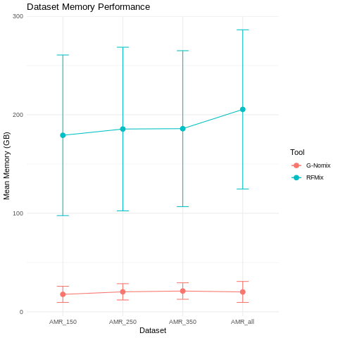
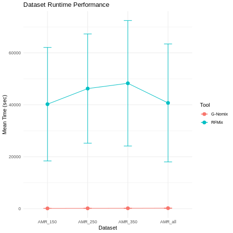
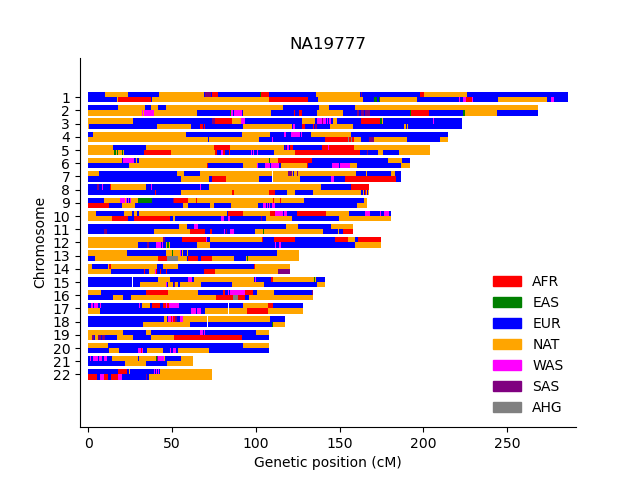

# Evaluation of algorithms for infering local ancestry in Admixed American (AMR) populations
## Final project for CSE 284 (WI24)

G-Nomix (https://github.com/AI-sandbox/gnomix), RFMix v2 (https://github.com/slowkoni/rfmix) and MOSAIC (https://github.com/mststats/MOSAIC) were compared to assess their performance on infering local ancestry across different sample sizes.

### Datasets
The Admixed American (AMR) population of the 1000 Genomes Project Phase 3 dataset was used to ran each software using the rest of the populations as reference

### Software descriptions

| Software  | Algorithm | Pre-phasing | Gen map |
| --------- | --------- | ----------- | ------- |
| RFMix  | random forest  | required | yes |
| MOSAIC | two layer HMM  | required | yes |
| G-Nomix  | Two stages: 1) base module, 2) Smoother module | Required, can correct phasing errors | no |

### Download 1000 Genoms Project phased data Phase 3 

First, we need to download the data from the 1000 Genomes Project. We will use the phased data from Phase 3. The data is available in the following link: [1000 Genomes Project](ftp://ftp.1000genomes.ebi.ac.uk/vol1/ftp/release/20130502/). To download the data, we will use the `wget` command as follows:

```bash
ftp_path="https://ftp.1000genomes.ebi.ac.uk/vol1/ftp/release/20130502/"
file_name_prefix="ALL.chr"
file_name_sufix=".phase3_shapeit2_mvncall_integrated_v5b.20130502.genotypes.vcf.gz"
directory_path="./1000GenomesPhase3_phased/"
mkdir -p "$directory_path"
for chr in {1..22}; do 
echo "Downloading chr$chr"; 
wget  $ftp_path""$file_name_prefix""$chr""$file_name_sufix" -P "$directory_path"; 
done
```

The data will be downloaded in the directory `1000GenomesPhase3_phased`. The files are in compressed VCF format, and are divided by chromosome. We will have 22 files, one for each chromosome.

### America individuals

In folder `data`, we have four different files with subsets of american individuals from 1000 Genomes Project, including people with ancestry from Mexico, Peru, Columbia and Puerto Rico. We will use these files to filter the data from the 1000 Genomes Project and benchmark our tools with different number of individuals. The files are:

- `AMR_pop_150_samples.txt`
- `AMR_pop_250_samples.txt`
- `AMR_pop_350_samples.txt`
- `AMR_pop_all_samples.txt`

These files were created subsetting individuals with AMR ancestry from the 1000 Genomes Project donors. However, some donors presented in the general data were not present in the VCF files. The final number of individuals in each file is:

| File Name | Subset | Missing Individuals | Total Individuals |
|-----------|--------|---------------------|-------------------|
| AMR_pop_150_samples.txt | 150 individuals | 40 | 110 | 
| AMR_pop_250_samples.txt | 250 individuals | 77 | 173 |
| AMR_pop_350_samples.txt | 350 individuals | 106 | 244 |
| AMR_pop_all_samples.txt | 497 | 150 | 347 |

### Preprocessing
In this step we extract the donors within the `AMR_pop_*_samples.txt` files from the 1000 Genomes Project VCF files. 

```bcftools view -S {input.popcount} {input.vcf} --force-samples -Oz -o {output.vcf}```

Where `{input.popcount}` is the file with the list of individuals and `{input.vcf}` is the VCF file from the 1000 Genomes Project, and the output is a VCF file with the subset of individuals. THe flag `--force-samples` is used to ignore the missing individuals discussed above.


### Running each software
We ran each software using default parameters as follows:

**[RFMix v2](https://github.com/slowkoni/rfmix)**

Details of how RFMix was run in this analysis can be find in the [RFMix](./RFMix) folder.

**[G-Nomix](https://github.com/AI-sandbox/gnomix)**

Details of how G-Nomix was run in this analysis can be find in the [G-Nomix_analysis.ipynb](./GNomix/G-Nomix_analysis.ipynb) notebook.

**MOSAIC**

Not run successfully 

### Evaluation of results

#### Requirements

The majority of downstream analyses were performed in R. The scripts below make use the following libraries:

- [data.table](https://cran.r-project.org/web/packages/data.table/vignettes/datatable-intro.html)
- [ggplot2](https://ggplot2.tidyverse.org/)
- [here](https://here.r-lib.org/)

#### Computational resources
We can evaluate the runtime and memory usage against sample size by running the following script:

```bash
Rscript runtime_memory_performace_plot.R
```




#### Local ancestry
Each software outputs a msp file with the local ancestry of each individual per chromosome. We will use [haptools](https://haptools.readthedocs.io/en/stable/project_info/installation.html) to plot karyotypes for given donors and generate examples. The `msp2bp.R` script will covert the msp files to bp, a format haptools need to plot the karyotypes.

Here are some examples of how to run the `msp2bp.R` script:

It only requires an input directory with subfolders per each chromosome and an output file name. We can specify the file name of each file with the `--ifile` or `-f` flag, the default name is `query_results.msp`.

```bash
Rscript msp2bp.R -i results_gnomix/AMR_all/ -o example.bp 
```

By default, the command above will transform the data for all donors. However, if we want to transform the data for a subset of donors, we can use the `--donor` or `-d` flag. If multiple donors are used, they should be separated by a comma and no spaces.

```bash
Rscript msp2bp.R -i results_gnomix/AMR_all/ -o example.msp -d "HG01173,NA19777"
```

After generating the bp files, we can use `haptools karyogram` as follows:

```bash
haptools karyogram \
        --bp example.bp \
        --sample NA19777 \
        --out NA19777.png \
        --title NA19777 \
        --colors 'EUR:blue,AFR:red,EAS:green,SAS:purple,NAT:orange,OCE:cyan,AHG:gray,OCE:brown,WAS:magenta'
```
The karyotype below shows an example of local ancestry inferred by GNomix:



